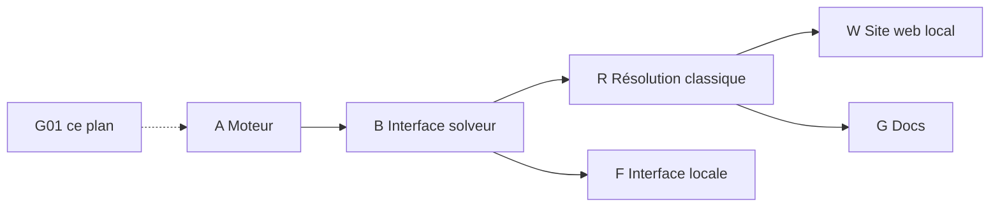

# Plan — Démineur local (projet "conquering AI")

## 0. Contexte et objectif

Reproduire le concept de la vidéo — un démineur (Minesweeper) entièrement **local** — avec un
solveur classique déterministe, explicable et performant (la résolution par LLM a été retirée
du périmètre ; l'écriture du code par IA reste le mode de travail du projet).

Objectifs :
1. Un moteur de démineur local, autonome, testable (CLI d'abord).
2. Un solveur classique déterministe complet (règles exactes, CSP, probabilités).
3. Des benchmarks reproductibles (presets de difficulté, seeds, déterminisme strict).
4. Un site web de visualisation local (replay, justifications, benchmarks).
5. Ce document sert de référence : plan, état d'avancement, solutions, graphe lisible par LLM.

## 1. Contraintes

- Local-first : le moteur, les tests et la CLI ne dépendent d'aucun réseau.
- Pas de dépendance lourde : stdlib Python prioritaire ; chaque ajout justifié.
- Chaque tâche du plan = un commit atomique vérifiable.

## 2. Plan fragmenté

Chaque item est une micro-tâche (idéalement < 1h). `ID` sert de référence dans le graphe (§5).
Statut : `[ ]` à faire, `[~]` en cours, `[x]` fait, `[!]` bloqué.

### Phase A — Fondations moteur de jeu (A01 → A16)

- [x] A01 : repo — créer `src/demineur/__init__.py`, structure de packages `src/`, `tests/`.
- [x] A02 : repo — config Python minimale (`pyproject.toml` ou `requirements.txt`), style (ruff/black), CI si dispo.
- [x] A03 : type `Cell` — structure immuable (état: hidden/revealed/flagged, mine: bool, voisins_mines: int).
- [x] A04 : type `Board` — grille 2D, génération déterministe (seed) pour reproductibilité des tests.
- [x] A05 : placement des mines — aléatoire avec densité configurable, premier coup toujours sûr (aucune mine sur la case cliquée ni ses voisines).
- [x] A06 : calcul des compteurs — nombre de mines adjacentes par case.
- [x] A07 : révélation — cas simple (case sans mine).
- [x] A08 : révélation en cascade (flood fill) des cases à 0 mines adjacentes.
- [x] A09 : drapeaux (flag/unflag) et compteur de mines restantes.
- [x] A10 : condition de victoire (toutes les cases sans mine révélées).
- [x] A11 : condition de défaite (révélation d'une mine) + état terminal `GameState` (playing/won/lost).
- [x] A12 : invariant — `Board` ne peut pas être reconstruit/muté par le joueur après coup de mine (anti-triche : l'emplacement des mines est figé au premier coup).
- [x] A13 : tests unitaires A03→A12 (une classe de test par module, seed fixe).
- [x] A14 : smoke — script `python -m demineur.play --seed 42 --w 9 --h 9 --mines 10` jouable au clavier.
- [x] A15 : sérialisation du plateau — format JSON versionné (état complet + vue joueur), unique source pour W03 et les fixtures de test ; rétro-compatible.
- [x] A16 : presets de difficulté — `beginner/intermediate/expert` (9×9/10, 16×16/40, 30×16/99) + difficulté personnalisée ; utilisé par CLI, solveurs et benchmarks.

### Phase B — Interface solveur (B01 → B10)

- [x] B01 : contrat `Solver` — `action(game_view) -> Action` où `game_view` ne divulgue que l'information visible du joueur (anti-fuite d'information, vrai pour tout solveur, humain compris).
- [x] B02 : type `Action` — `Reveal(x, y)` | `Flag(x, y)` | `Unflag(x, y)` | `GiveUp(reason)`.
- [x] B03 : sérialisation — exporter `game_view` en texte compact (grille ASCII + historique des coups), utile pour les logs, l'explicabilité et le web.
- [x] B04 : parsing — charger une `Action` depuis sa forme sérialisée (replay, scripts, fixtures) avec validation stricte.
- [x] B05 : solveur baseline `RandomSolver` (aléatoire légal) — étalon bas de comparaison.
- [x] B06 : solveur déterministe `RuleSolver` **minimal** — uniquement la règle single-point (R02) ; version de démarrage, absorbée puis remplacée par le solveur classique complet de la phase R (R10).
- [x] B07 : limite de coups / timeout par action (un solveur qui boucle ne bloque pas la partie).
- [x] B08 : tests — le solveur baseline termine toujours une partie ; `RuleSolver` gagne sur des grilles faciles seedées.
- [x] B09 : boucle de jeu centralisée — un seul `GameRunner` (humain ou solveur) : applique une `Action`, refuse les actions illégales (case déjà révélée, hors grille, drapeau sur révélée), enregistre l'événement, détecte fin de partie. Politique explicite en cas d'action illégale (rejet + compteur, abandon après N rejets) — supprime toute duplication entre R10, F03, W13.
- [x] B10 : format d'événement unifié — un événement de partie = `(numéro de coup, vue avant [A15], action, règle/justification si présente, vue après, résultat)` ; contrat unique consommé par W02 (API), W06 (replay), W07 (justifications), R14 (benchmarks).

### Phase R — Résolution classique (déterministe, sans LLM) (R01 → R18)

Objectif de cette phase : le meilleur solveur « classique » possible, entièrement local,
explicable, rapide et reproductible. C'est le cœur du projet. Toutes les techniques sont
déterministes et testables.

- [x] R01 : noyau d'analyse — extraire de la vue joueur la liste des contraintes `(ensemble de cases frontière, nombre de mines)`.
- [x] R02 : règle single-point — contrainte satisfaite → ses cases restantes sont sûres ; contrainte avec autant de cases que de mines → toutes des mines.
- [x] R03 : règle subset — si C1 ⊆ C2 alors C2−C1 hérite de `mines(C2)−mines(C1)` (généralise les motifs 1-2-1, 1-2-2-1).
- [x] R04 : intersection croisée — si les cases restantes d'une contrainte sont déjà toutes des mines (via drapeaux), en déduire les révélations sûres ailleurs.
- [x] R05 : énumération CSP — partitionner les contraintes en composantes connexes indépendantes, énumérer les solutions valides par composante (plafond de taille).
- [x] R06 : classification CSP — pour chaque case : toujours-mine / jamais-mine / incertaine (à partir de l'énumération R05).
- [x] R07 : comptage exact global — combinatoire sur toutes les composantes + cases inconnues hors frontière → probabilité exacte d'être une mine pour chaque case.
- [x] R08 : choix du coup sûr — révéler en priorité une case jamais-mine (R06) ; sinon poser un drapeau sur une toujours-mine utile.
- [x] R09 : heuristique de guess — en cas d'incertitude totale : minimiser la probabilité de mine (R07), départager par nombre de voisins révélés, coin/bord en dernier recours.
- [x] R10 : résolution complète — boucle moteur : analyser → jouer → jusqu'à victoire/défaite/limite de coups (B07).
- [x] R11 : explicabilité — chaque décision émet une justification textuelle courte (`"R03: subset → (2,3) sûr"`), affichable en CLI (R15) et dans le web (W07).
- [x] R12 : détection de configuration impossible — si le CSP n'a aucune solution, signaler un bug moteur ou une vue corrompue (fail-fast, utile pour D02).
- [x] R13 : tests — grilles seedées couvrant chaque règle (une fixture par règle, y compris cas 1-2-1 et devinette forcée).
- [x] R14 : benchmark — win-rate sur N seeds par difficulté, comparé à RandomSolver et RuleSolver (B05, B06) ; **harnais unique partagé entre R14 et les tests de non-régression** (pas de code dupliqué) ; résultats dans `docs/benchmarks.md`.
- [x] R15 : commandes CLI — `demineur solve --seed X --method classic` + `--explain` pour afficher les justifications (R11).
- [x] R16 : documentation — `docs/classic_solver.md` : chaque règle, sa preuve, ses cas limites.
- [x] R17 : repli d'énumération — comportement défini si une composante CSP dépasse le plafond de R05 : décomposition en sous-contraintes, à défaut règles R02-R04 seules + probabilité uniforme ; jamais d'échec silencieux ni de blocage.
- [x] R18 : budget de performance — profilage du pire cas (grille expert avec longue frontière) ; plafond de temps par coup documenté et testé (le solveur classique doit rester rapide quel que soit le plateau).

### Phase W — Site web de visualisation (local, localhost uniquement) (W01 → W20)

Objectif : visualiser dans un navigateur, en local, les parties, les décisions du solveur
classique et les benchmarks. Aucun déploiement distant : le site
est servi par un petit serveur local qui lit les artefacts (logs JSONL, mémoires, benchmarks).

- [x] W01 : socle serveur local — petit serveur HTTP (stdlib `http.server` ou framework léger déjà présent) qui sert `web/` sur `127.0.0.1` uniquement (rappeler INV5).
- [x] W02 : API JSON locale — endpoints `/api/games`, `/api/games/{id}`, `/api/solvers`, `/api/benchmarks` alimentés par les artefacts (événements B10, benchmarks R14).
- [x] W03 : contrat de données — schéma JSON stable partagé CLI ↔ API ↔ frontend (versionné, rétro-compatible).
- [x] W04 : structure frontend — `web/` statique (HTML/CSS/JS sans build lourd) ; pas de bundler obligatoire.
- [x] W05 : composant grille — rendu du plateau de démineur (cases, drapeaux, compteurs) depuis un état JSON.
- [x] W06 : replay interactif — rejouer une partie loggée coup par coup (boutons ◀ ▶, vitesse, saut au coup fatal).
- [x] W07 : surcouche décisions — afficher par coup la justification du solveur (R11) à côté de la grille.
- [x] W08 : visualisation des probabilités — heatmap des probabilités de mines (R07) sur la grille pendant le replay.
- [x] W09 : visualisation des contraintes — surligner la composante CSP active (R05) et les cases sûres/dangereuses (R06) par coup.
- [x] W10 : vue benchmarks — tableaux + graphes (win-rate par solveur × difficulté, R14) en JS pur ou lib de chart légère si justifiée.
- [ ] W11 : (annulé) vue mémoire de leçons — dépendait de la phase E (apprentissage LLM), retirée du périmètre ; ID conservé pour la stabilité du graphe.
- [ ] W12 : (annulé) vue journal d'auto-résolution — dépendait de la phase D (auto-résolution LLM), retirée du périmètre ; ID conservé pour la stabilité du graphe.
- [x] W13 : mode live — page qui joue une partie en direct (solveur classique) avec rafraîchissement du plateau via polling local.
- [x] W14 : mode duel web — l'humain joue une partie dans le navigateur, le solveur classique joue la même grille seedée en parallèle (F03, web).
- [x] W15 : tests — tests d'API (endpoints, codes d'erreur, isolation localhost) ; tests frontend basiques (rendu grille depuis un JSON de fixture).
- [x] W16 : sécurité locale — bindings `127.0.0.1` vérifiés, aucune écriture serveur hors répertoire de travail, pas de secret exposé (INV4, INV5).
- [x] W17 : intégration CLI — `demineur serve` lance le site ; `demineur serve --open` ouvre le navigateur local.
- [x] W18 : documentation — `docs/web.md` : architecture, endpoints, format de replay, limites (local uniquement).
- [x] W19 : assets 100% locaux — aucun CDN, aucune police/script distant ; le site fonctionne hors ligne (cohérent avec l'objectif local et INV5).
- [x] W20 : tests du mode live — W13 testé sans réseau externe : partie simulée par un solveur déterministe, polling sur 127.0.0.1 uniquement, arrêt propre du serveur.

### Phase F — Interface locale (F01 → F07)

- [x] F01 : CLI complète — `demineur new|play|solve|benchmark|serve` avec `--seed`, `--difficulty` (intègre les commandes R15 et W17).
- [x] F02 : rendu terminal — affichage coloré de la grille (ANSI, sans dépendance).
- [x] F03 : mode duel — solveur classique vs humain sur la même grille seedée.
- [x] F04 : mode spectateur (CLI) — rejouer une partie loggée coup par coup dans le terminal ; version web riche = W06 (pas de duplication : F04 = rendu texte minimal, W06 = replay interactif complet).
- [ ] F05 : (annulé) interface TUI/web locale — remplacée par la phase W (W01→W18) ; ID conservé pour la stabilité du graphe, aucune arête n'en dépend.
- [x] F06 : packaging — `pip install -e .` fonctionne ; point d'entrée `demineur`.
- [x] F07 : README — guide d'installation et d'utilisation locale.

### Phase G — Documentation et traçabilité (G01 → G06)

- [x] G01 : ce document — plan fragmenté + graphe lisible par LLM.
- [ ] G02 : (annulé) `docs/autofix_log.md` — dépendait de la phase D (auto-résolution LLM), retirée du périmètre ; ID conservé pour la stabilité du graphe.
- [x] G03 : `docs/benchmarks.md` — résultats des benchmarks par solveur.
- [ ] G04 : (annulé) `docs/lessons.md` — dépendait de la phase E (apprentissage LLM), retirée du périmètre ; ID conservé pour la stabilité du graphe.
- [x] G05 : protocole d'agent — `docs/agent_protocol.md` : comment un agent (IA ou humain) choisit une tâche dans le graphe (§5) : prendre le plus petit ID dont toutes les arêtes `depends_on` sont `[x]`, respecter les invariants, mettre à jour §3 + statut, commit atomique.
- [x] G06 : documentation d'architecture — `docs/architecture.md` : schéma des modules (moteur, GameRunner B09, solveurs, serveur web) et flux de données (A15/B10 → W02).

## 3. Ce qui a été fait (journal d'avancement)

| Date | Tâche | Résumé |
|------|-------|--------|
| session 1 | G01 | Création de ce plan fragmenté (A→G, 60+ micro-tâches) et du graphe de dépendances lisible par LLM. Aucune ligne de moteur encore écrite. |
| session 1 | G01 | Ajout de la phase R « Résolution classique » (R01→R16) : contraintes, règles single-point/subset, CSP, probabilités exactes, heuristique de guess, explicabilité, CLI et benchmark. Le graphe (§5) intègre les 16 nouveaux nœuds. |
| session 1 | G01 | Ajout de la phase W « Site web de visualisation » (W01→W18) : serveur local 127.0.0.1, API JSON, replay interactif, heatmaps de probabilités, vues benchmarks/leçons/auto-résolution, mode live et duel. Le graphe (§5) intègre les 18 nouveaux nœuds. |
| session 1 | G01 | Audit d'intégrité : total réel = 98 micro-tâches (correction du « 60+ » initial) ; résolution des redondances B06↔phase R, F04↔W06, F05↔phase W (F05 annulé) ; F01 intègre les commandes R15/W17 ; INV5 mis à jour (C03, W01, W16) ; arêtes de traçabilité ajoutées (B06→R02, R15→F01, W17→F01, C09→G03) ; nœuds du graphe réordonnés par phase ; typos corrigées (E04, E06). |
| session 1 | G01 | Retrait de la résolution par LLM : phases C (solveur LLM), D (auto-résolution), E (apprentissage) supprimées ; tâches W11, W12, G02, G04 annulées (dépendaient de D/E) ; tâches B03/B04/F01/F03/W02/W07/W10/W13/W14 reformulées sans LLM ; graphe purgé des nœuds/arêtes C/D/E ; décisions et invariants mis à jour. Total : 77 tâches actives (112 - 35 supprimées : C01-C14, D01-D11, E01-E10). |
| session 1 | G01 | Critique & renforcement : 14 nouvelles tâches (total 112) — A15/A16 (sérialisation JSON versionnée, presets de difficulté), B09/B10 (GameRunner centralisé, format d'événement unifié), R17/R18 (repli CSP, budget de perf), C13/C14 (déterminisme de benchmark, anti-injection de prompt), E10 (sanitisation des leçons), W19/W20 (assets locaux, tests live), D11 (contre-vérification des invariants), G05/G06 (protocole d'agent, doc d'architecture). Motivation : anti-duplication (B09/B10/A15), robustesse pire-cas (R17/R18), validité scientifique des mesures (C13), sécurité (C14/E10/W19), autonomie agent (G05). |

| session 2 | A01→A16 | Moteur complet : packages src/tests + config (A01-A02), Cell/Board seedés (A03-A04), mines au premier coup zone sûre (A05-A06), révélation en cascade, drapeaux, victoire/défaite, anti-triche (A07-A12), tests unitaires (A13), CLI play (A14), sérialisation JSON v1 (A15), presets (A16). |
| session 2 | B01→B10 | Contrat Solver sur vue joueur (B01), Action + parsing strict (B02/B04), export texte (B03), étalons random et single-point (B05/B06), limites de coups (B07), GameRunner centralisé avec politique de rejet (B09), format d'événement unifié (B10). |
| session 2 | R01→R18 | Solveur classique complet : contraintes (R01), single-point/subset/intersection (R02-R04), CSP par composantes plafonné (R05), classification (R06), probabilités exactes par combinatoire + comptage global (R07), coup sûr (R08), heuristique de guess (R09), boucle complète (R10), justifications (R11), détection d'impossible (R12), fixtures (R13), harnais benchmark déterministe (R14), CLI solve --explain (R15), doc des règles (R16), repli sous-contraintes + uniforme (R17), budget perf 1s/coup testé (R18). |
| session 2 | F01→F07 | CLI complète new/play/solve/benchmark/duel/replay/serve, rendu ANSI, duel humain vs solveur même seed, mode spectateur, artefacts JSONL, pip install -e vérifié, README. |
| session 2 | W01→W20 | Serveur local stdlib 127.0.0.1 (W01/W16), API JSON sur artefacts + analyse par coup (W02), schéma partagé A15 (W03), frontend statique sans bundler (W04), grille/replay/justifications/heatmap/CSP/benchmarks (W05-W10), mode live polling local (W13/W20), duel web (W14), tests API + frontend node (W15), demineur serve --open (W17), doc web (W18), assets 100% locaux testés (W19). |
| session 2 | G03/G05/G06 | docs/benchmarks.md (30 seeds beginner : classic 96,7%, rule 73,3%, random 0%), protocole d'agent, architecture. 176 tests verts, 6 commits atomiques. |

| session 3 | R18/R14/C13 | Correction des points de KNOWN_ERRORS.md : évaluation paresseuse de l'analyse (CSP/probabilités seulement si les règles ne déduisent rien — pire coup expert 0.14s, marge ×7 sur le plafond), lint ruff 0 erreur (31 corrigés), option solve --save JSONL, fallback de rule seedé par la partie (benchmarks strictement déterministes), validation case minée révélée en game_from_json. 177 tests verts. |

Règle de mise à jour : chaque tâche terminée ajoute une ligne ici et passe à `[x]` dans sa phase.

Règle de mise à jour : chaque tâche terminée ajoute une ligne ici et passe à `[x]` dans sa phase.

## 4. Solutions abordées et décisions

| Sujet | Options envisagées | Décision | Raison |
|-------|--------------------|----------|--------|
| Moteur de jeu | (a) lib existante, (b) moteur maison minimal | (b) | Local-first, testable, contrôlé par le LLM lui-même — cohérent avec le concept de la vidéo |
| Révélation des mines | mines placées d'avance vs au premier coup | au premier coup (A05, A12) | parties toujours jouables, reproductibles par seed |
| Anti-fuite d'info | solver voit la grille complète vs vue joueur | vue joueur uniquement (B01) | tout solveur doit raisonner comme un joueur, sinon les résultats sont faussés |
| Étalon | aucun / RandomSolver / RuleSolver | les deux (B05, B06) | mesure honnête de l'apport du LLM ; B06 volontairement minimal, la phase R fournit l'étalon dur complet (anti-redondance : B06 absorbée par R10) |
| Résolution classique | LLM vs solveur déterministe complet | solveur déterministe seul (R01→R18) ; la partie LLM a été retirée du périmètre | étalon dur, explicable, rapide, reproductible ; l'IA reste le mode de rédaction du code |
| Guess en incertitude | aléatoire vs minimisation de probabilité exacte | probabilités combinatoires (R07, R09) | réduit les défaites évitables, benchmark reproductible |
| Visualisation web | app distante vs site local servi par le projet | site local 127.0.0.1 (W01, W16) | cohérent avec l'objectif « tourne en local » ; aucun déploiement ni exposition publique |
| Frontend | framework SPA vs pages statiques légères | statiques sans bundler obligatoire, assets 100% locaux (W04, W19) | zéro dépendance lourde, fonctionne hors ligne, modifiable par le LLM lui-même |
| Validité des mesures | benchmark naïf vs protocole contrôlé | seeds fixés, presets A16, ré-exécution = mêmes résultats (determinisme du moteur et des solveurs) | sans reproductibilité, les comparaisons de solveurs n'ont pas de sens |

## 5. Graphe lisible par LLM

Format : liste d'arêtes `source -> cible [type]` (type ∈ `depends_on`, `uses`, `measures`),
suivie d'une définition des nœuds. Ce format est conçu pour être parsé directement par un LLM
(une arête par ligne, IDs stables).

```text
# EDGES
A01 -> A02        [depends_on]
A01 -> A03        [depends_on]
A03 -> A04        [depends_on]
A04 -> A05        [depends_on]
A05 -> A06        [depends_on]
A06 -> A07        [depends_on]
A07 -> A08        [depends_on]
A07 -> A09        [depends_on]
A07 -> A10        [depends_on]
A07 -> A11        [depends_on]
A05 -> A12        [depends_on]
A03 -> A13        [depends_on]
A04 -> A13        [depends_on]
A05 -> A13        [depends_on]
A06 -> A13        [depends_on]
A07 -> A13        [depends_on]
A08 -> A13        [depends_on]
A09 -> A13        [depends_on]
A10 -> A13        [depends_on]
A11 -> A13        [depends_on]
A12 -> A13        [depends_on]
A13 -> A14        [depends_on]
A03 -> A15        [depends_on]
A04 -> A15        [depends_on]
A15 -> A16        [depends_on]
A14 -> B01        [uses]
B01 -> B09        [uses]
B02 -> B09        [depends_on]
A11 -> B09        [depends_on]
B09 -> B10        [depends_on]
A15 -> B10        [uses]
B01 -> R01        [uses]
B04 -> R01        [uses]
B06 -> R02        [uses]
R01 -> R02        [depends_on]
R01 -> R03        [depends_on]
R02 -> R04        [depends_on]
R03 -> R04        [depends_on]
R01 -> R05        [depends_on]
R02 -> R05        [depends_on]
R05 -> R06        [depends_on]
R05 -> R07        [depends_on]
R06 -> R08        [depends_on]
R07 -> R09        [depends_on]
B09 -> R10        [depends_on]
B07 -> R10        [depends_on]
R08 -> R10        [depends_on]
R09 -> R10        [depends_on]
R02 -> R11        [depends_on]
R03 -> R11        [depends_on]
R06 -> R11        [depends_on]
R05 -> R17        [depends_on]
R05 -> R18        [depends_on]
R10 -> R18        [depends_on]
R05 -> R12        [depends_on]
R13 -> R14        [depends_on]
R10 -> R14        [depends_on]
R10 -> R15        [depends_on]
R11 -> R15        [depends_on]
R14 -> G03        [depends_on]
R16 -> G04        [depends_on]
A02 -> W01        [depends_on]
W01 -> W02        [depends_on]
W02 -> W03        [depends_on]
W03 -> W04        [depends_on]
W04 -> W05        [depends_on]
W05 -> W06        [depends_on]
W05 -> W07        [depends_on]
R11 -> W07        [uses]
W05 -> W08        [depends_on]
R07 -> W08        [uses]
W05 -> W09        [depends_on]
R05 -> W09        [uses]
R06 -> W09        [uses]
W02 -> W10        [depends_on]
R14 -> W10        [uses]
W02 -> W11        [depends_on]
W02 -> W12        [depends_on]
W06 -> W13        [depends_on]
W02 -> W13        [depends_on]
W13 -> W14        [depends_on]
F03 -> W14        [uses]
W02 -> W15        [depends_on]
W04 -> W19        [depends_on]
W13 -> W20        [depends_on]
B09 -> W13        [uses]
W01 -> W16        [depends_on]
W01 -> W17        [depends_on]
F01 -> W17        [uses]
W18 -> G04        [depends_on]
B01 -> B02        [depends_on]
B01 -> B03        [depends_on]
B02 -> B04        [depends_on]
B01 -> B05        [uses]
B01 -> B06        [uses]
B02 -> B07        [depends_on]
A13 -> B08        [depends_on]
A02 -> F06        [depends_on]
R15 -> F01        [uses]
W17 -> F01        [uses]
A16 -> F01        [uses]
A14 -> F02        [uses]
F01 -> F03        [depends_on]
F01 -> F04        [depends_on]
F04 -> F05        [depends_on]
F01 -> F06        [depends_on]
F01 -> F07        [depends_on]
B10 -> W06        [uses]
B10 -> W07        [uses]
A15 -> W03        [uses]
A16 -> R14        [uses]
G05 -> G06        [depends_on]

# NODES
# id | phase | type | description
A01  | A | infra   | structure de packages src/tests
A02  | A | infra   | config Python, style, CI
A03  | A | code    | type Cell
A04  | A | code    | type Board (seed deterministe)
A05  | A | code    | placement des mines (premier coup sur)
A06  | A | code    | compteurs de mines adjacentes
A07  | A | code    | revelation simple
A08  | A | code    | revelation en cascade (flood fill)
A09  | A | code    | drapeaux
A10  | A | code    | condition de victoire
A11  | A | code    | condition de defaite + GameState
A12  | A | code    | invariant anti-triche (mines figees)
A13  | A | test    | tests unitaires du moteur
A14  | A | cli     | demo jouable au clavier
A15  | A | code    | serialisation JSON versionnee du plateau
A16  | A | code    | presets de difficulte (beginner/intermediate/expert)
B01  | B | code    | contrat Solver (vue joueur uniquement)
B02  | B | code    | type Action
B03  | B | code    | serialisation game_view -> texte LLM
B04  | B | code    | parsing reponse LLM -> Action validee
B05  | B | code    | RandomSolver (etalon)
B06  | B | code    | RuleSolver deterministe (etalon)
B07  | B | code    | limites de coups / timeout
B08  | B | test    | tests des solveurs etalons
B09  | B | code    | GameRunner centralise (actions legales, politique rejet)
B10  | B | code    | format d'evenement unifie (vue avant/apres, action, justification)
R01  | R | code    | extraction des contraintes depuis la vue joueur
R02  | R | rule    | regle single-point
R03  | R | rule    | regle subset (1-2-1, 1-2-2-1)
R04  | R | rule    | intersection croisee
R05  | R | code    | enumeration CSP par composante
R06  | R | code    | classification toujours-mine / jamais-mine
R07  | R | code    | probabilites exactes par combinatoire
R08  | R | code    | choix du coup sur
R09  | R | code    | heuristique de devinette optimale
R10  | R | code    | boucle de resolution complete
R11  | R | code    | justifications textuelles par coup
R12  | R | code    | detection de configuration impossible
R13  | R | test    | fixtures par regle (grilles seedees)
R14  | R | bench   | benchmark du solveur classique
R15  | R | cli     | commande solve --method classic --explain
R16  | R | doc     | doc des regles classiques
R17  | R | code    | repli d'enumeration si composante CSP trop grande
R18  | R | code    | budget de performance du pire cas
F01  | F | cli     | CLI complete
F02  | F | ui      | rendu terminal ANSI
F03  | F | ui      | mode duel LLM vs humain
F04  | F | ui      | mode spectateur (replay)
F05  | F | annule  | (annule) remplace par la phase W
F06  | F | pkg     | packaging pip install -e .
F07  | F | doc     | README d'utilisation
W01  | W | infra   | serveur HTTP local (127.0.0.1 uniquement)
W02  | W | code    | API JSON locale sur les artefacts
W03  | W | code    | schema JSON partage (CLI/API/frontend)
W04  | W | infra   | structure frontend statique sans bundler
W05  | W | code    | composant grille demineur
W06  | W | code    | replay interactif coup par coup
W07  | W | code    | surcouche justifications par coup
W08  | W | code    | heatmap des probabilites de mines
W09  | W | code    | visualisation contraintes CSP
W10  | W | code    | vue benchmarks (win-rate par solveur)
W11  | W | code    | vue memoire de lecons
W12  | W | code    | vue journal d'auto-resolution
W13  | W | code    | mode live (partie en direct)
W14  | W | code    | mode duel humain vs solveur (web)
W15  | W | test    | tests API + rendu frontend
W16  | W | policy  | verifications securite locale (localhost, secrets)
W17  | W | cli     | commande demineur serve --open
W18  | W | doc     | doc architecture web
W19  | W | policy  | assets 100% locaux (aucun CDN), fonctionne hors ligne
W20  | W | test    | tests du mode live sans reseau externe
G01  | G | doc     | ce document (plan + graphe)
G02  | G | doc     | journal auto-resolution
G03  | G | doc     | resultats benchmarks
G04  | G | doc     | synthese des lecons
G05  | G | doc     | protocole d'agent LLM (choix de tache via le graphe)
G06  | G | doc     | documentation d'architecture

# INVARIANTS (regles que tout agent LLM doit respecter)
# INV1: le solver ne voit jamais l'emplacement reel des mines (B01)
# INV2: les tests sont la source de verite et ne sont jamais modifies pour faire passer une fonctionnalite
# INV3: chaque tache terminee = une ligne dans la section 3 et un [x] dans sa phase
# INV4: aucun secret n'est commit dans le depot
# INV5: aucune ecoute reseau autre que localhost (W01, W16)
```

Vue Mermaid équivalente (phases uniquement, pour lecture humaine) :



## 6. Ordre de mise en œuvre recommandé

1. A01 → A16 (moteur vert, testé, sérialisable, presets) — prérequis de tout le reste.
2. B01 → B10 (contrat solveur, GameRunner centralisé, format d'événement, étalons simples) — permet de mesurer avant d'ajouter le LLM.
3. R01 → R18 (résolution classique) — cœur du projet : solveur déterministe complet, explicable et rapide.
4. F01 → F07 (interface) — confort d'usage local.
5. W01 → W20 (site web de visualisation) — une fois que R et les benchmarks produisent des artefacts à montrer ; 100% local (W19).
6. G02 → G06 (docs) — en continu ; G05 (protocole d'agent) rend le plan auto-exécutable.

Note : les phases se chevauchent volontairement — le protocole d'agent (G05) prime sur l'ordre nominal : une tâche est faisable dès que toutes ses arêtes `depends_on` sont `[x].