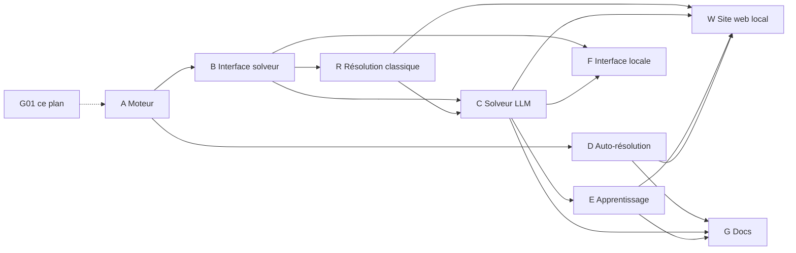

# Plan — Démineur local résolu par LLM (projet "conquering AI")

## 0. Contexte et objectif

Reproduire le concept de la vidéo : une IA (LLM) crée le code et résout les problèmes du démineur
(Minesweeper), avec éventuellement une boucle d'apprentissage. Différence clé avec la vidéo :
**le démineur tourne entièrement en local** (aucun service distant, aucun navigateur requis).

Objectifs :
1. Un moteur de démineur local, autonome, testable (CLI d'abord).
2. Un solveur piloté par LLM (inférence locale ou API configurable).
3. Une boucle "problème → diagnostic LLM → correctif LLM → re-test" (auto-résolution).
4. Une trace d'apprentissage : chaque partie nourrit une mémoire (stratégies, erreurs, corrections).
5. Ce document sert de référence : plan, état d'avancement, solutions, graphe lisible par LLM.

## 1. Contraintes

- Local-first : le moteur, les tests et la CLI ne dépendent d'aucun réseau.
- Le LLM est interchangeable : interface `Solver` unique, backends (API distante optionnelle,
  modèle local, heuristique pure) derrière cette interface.
- Pas de dépendance lourde : stdlib Python prioritaire ; chaque ajout justifié.
- Chaque tâche du plan = un commit atomique vérifiable.

## 2. Plan fragmenté

Chaque item est une micro-tâche (idéalement < 1h). `ID` sert de référence dans le graphe (§5).
Statut : `[ ]` à faire, `[~]` en cours, `[x]` fait, `[!]` bloqué.

### Phase A — Fondations moteur de jeu (A01 → A14)

- [ ] A01 : repo — créer `src/demineur/__init__.py`, structure de packages `src/`, `tests/`.
- [ ] A02 : repo — config Python minimale (`pyproject.toml` ou `requirements.txt`), style (ruff/black), CI si dispo.
- [ ] A03 : type `Cell` — structure immuable (état: hidden/revealed/flagged, mine: bool, voisins_mines: int).
- [ ] A04 : type `Board` — grille 2D, génération déterministe (seed) pour reproductibilité des tests.
- [ ] A05 : placement des mines — aléatoire avec densité configurable, premier coup toujours sûr (aucune mine sur la case cliquée ni ses voisines).
- [ ] A06 : calcul des compteurs — nombre de mines adjacentes par case.
- [ ] A07 : révélation — cas simple (case sans mine).
- [ ] A08 : révélation en cascade (flood fill) des cases à 0 mines adjacentes.
- [ ] A09 : drapeaux (flag/unflag) et compteur de mines restantes.
- [ ] A10 : condition de victoire (toutes les cases sans mine révélées).
- [ ] A11 : condition de défaite (révélation d'une mine) + état terminal `GameState` (playing/won/lost).
- [ ] A12 : invariant — `Board` ne peut pas être reconstruit/muté par le joueur après coup de mine (anti-triche : l'emplacement des mines est figé au premier coup).
- [ ] A13 : tests unitaires A03→A12 (une classe de test par module, seed fixe).
- [ ] A14 : smoke — script `python -m demineur.play --seed 42 --w 9 --h 9 --mines 10` jouable au clavier.

### Phase B — Interface solveur (B01 → B08)

- [ ] B01 : contrat `Solver` — `action(game_view) -> Action` où `game_view` ne divulgue que l'information visible du joueur (anti-fuite d'information).
- [ ] B02 : type `Action` — `Reveal(x, y)` | `Flag(x, y)` | `Unflag(x, y)` | `GiveUp(reason)`.
- [ ] B03 : sérialisation — exporter `game_view` en texte compact lisible par LLM (grille ASCII + règles + historique des coups).
- [ ] B04 : parsing — parser la réponse du LLM en `Action` validée (rejet + re-prompt en cas d'action illégale ou mal formée).
- [ ] B05 : solveur baseline `RandomSolver` (aléatoire légal) — étalon de comparaison.
- [ ] B06 : solveur déterministe `RuleSolver` — règles exactes classiques (single-point, subset/1-2-1, éventuellement CSP simple) — étalon "sans IA".
- [ ] B07 : limite de coups / timeout par action (un LLM qui boucle ne bloque pas la partie).
- [ ] B08 : tests — le solveur baseline termine toujours une partie ; `RuleSolver` gagne sur des grilles faciles seedées.

### Phase R — Résolution classique (déterministe, sans LLM) (R01 → R16)

Objectif de cette phase : le meilleur solveur « classique » possible, entièrement local et
explicable, qui servira (i) d'étalon dur pour le solveur LLM et (ii) de base de connaissances
que le LLM pourra consulter / réutiliser. Toutes les techniques sont déterministes et testables.

- [ ] R01 : noyau d'analyse — extraire de la vue joueur la liste des contraintes `(ensemble de cases frontière, nombre de mines)`.
- [ ] R02 : règle single-point — contrainte satisfaite → ses cases restantes sont sûres ; contrainte avec autant de cases que de mines → toutes des mines.
- [ ] R03 : règle subset — si C1 ⊆ C2 alors C2−C1 hérite de `mines(C2)−mines(C1)` (généralise les motifs 1-2-1, 1-2-2-1).
- [ ] R04 : intersection croisée — si les cases restantes d'une contrainte sont déjà toutes des mines (via drapeaux), en déduire les révélations sûres ailleurs.
- [ ] R05 : énumération CSP — partitionner les contraintes en composantes connexes indépendantes, énumérer les solutions valides par composante (plafond de taille).
- [ ] R06 : classification CSP — pour chaque case : toujours-mine / jamais-mine / incertaine (à partir de l'énumération R05).
- [ ] R07 : comptage exact global — combinatoire sur toutes les composantes + cases inconnues hors frontière → probabilité exacte d'être une mine pour chaque case.
- [ ] R08 : choix du coup sûr — révéler en priorité une case jamais-mine (R06) ; sinon poser un drapeau sur une toujours-mine utile.
- [ ] R09 : heuristique de guess — en cas d'incertitude totale : minimiser la probabilité de mine (R07), départager par nombre de voisins révélés, coin/bord en dernier recours.
- [ ] R10 : résolution complète — boucle moteur : analyser → jouer → jusqu'à victoire/défaite/limite de coups (B07).
- [ ] R11 : explicabilité — chaque décision émet une justification textuelle courte (`"R03: subset → (2,3) sûr"`), réutilisable comme few-shot pour le LLM (C04).
- [ ] R12 : détection de configuration impossible — si le CSP n'a aucune solution, signaler un bug moteur ou une vue corrompue (fail-fast, utile pour D02).
- [ ] R13 : tests — grilles seedées couvrant chaque règle (une fixture par règle, y compris cas 1-2-1 et devinette forcée).
- [ ] R14 : benchmark — win-rate sur N seeds par difficulté, comparé à RandomSolver et RuleSolver (B05, B06) ; résultats dans `docs/benchmarks.md`.
- [ ] R15 : commandes CLI — `demineur solve --seed X --method classic` + `--explain` pour afficher les justifications (R11).
- [ ] R16 : documentation — `docs/classic_solver.md` : chaque règle, sa preuve, ses cas limites.

### Phase C — Solveur LLM (C01 → C12)

- [ ] C01 : abstraction backend — `LLMBackend.complete(prompt) -> str` (aucun provider imposé).
- [ ] C02 : backend API distante optionnelle (clé via variable d'environnement, jamais commitée).
- [ ] C03 : backend local (ex. llama.cpp / ollama en localhost uniquement) — optionnel, derrière `LLMBackend`.
- [ ] C04 : prompt système v1 — règles du démineur + format de sortie JSON strict + exemples few-shot.
- [ ] C05 : prompt dynamique — injecter `game_view` sérialisé + derniers coups + score.
- [ ] C06 : garde-fous — validation stricte du JSON, retry avec message d'erreur renvoyé au LLM (max N retries).
- [ ] C07 : `LLMSolver` complet branché sur le moteur (A14) via le contrat (B01).
- [ ] C08 : partie autonome — `python -m demineur.run_llm --seed 42` : le LLM joue une partie entière, log de chaque coup.
- [ ] C09 : métriques de partie — win rate, coups, actions illégales, tokens consommés.
- [ ] C10 : benchmark — N parties seedées vs `RandomSolver` et `RuleSolver` (tableau comparatif).
- [ ] C11 : cache/mémoire de prompts — éviter les appels redondants (même vue = même décision possible).
- [ ] C12 : tests — parties LLM simulées via backend mocké (aucun réseau dans les tests).

### Phase D — Auto-résolution de problèmes par LLM (D01 → D10)

- [ ] D01 : harnais de test — commande unique `make test` (ou équivalent) qui capture code, stdout, stderr, exit code.
- [ ] D02 : détecteur d'échec — à chaque commit, si un test échoue, produire un rapport d'erreur structuré (fichier + ligne + traceback).
- [ ] D03 : boucle de correctif — prompt LLM : (code en cause + traceback + contexte) → patch minimal proposé.
- [ ] D04 : application du patch — écriture du patch, re-run des tests, acceptation si verts, rollback sinon (max M itérations).
- [ ] D05 : journal d'auto-résolution — chaque tentative (échec → cause → patch → résultat) loggé dans `docs/autofix_log.md`.
- [ ] D06 : détection de régression — les tests verts doivent rester verts (aucun patch ne casse un module distant).
- [ ] D07 : garde-fou humain — aucun patch auto ne touche `tests/` ni la graine de génération (les tests sont la source de vérité).
- [ ] D08 : mode dry-run — afficher le patch proposé sans l'appliquer.
- [ ] D09 : budget — plafond d'appels LLM par session d'auto-résolution.
- [ ] D10 : tests de la boucle — injecter un bug volontaire, vérifier que la boucle le trouve et le corrige.

### Phase E — Apprentissage (E01 → E09)

- [ ] E01 : persistance des parties — chaque partie sérialisée (JSONL : vue, action, résultat, seed).
- [ ] E02 : extraction de leçons — après chaque partie, le LLM résume ce qui a marché/échoué en "règles de stratégie" courtes.
- [ ] E03 : mémoire de stratégies — fichier `memory/strategies.md` versionné, injecté dans le prompt système (C04).
- [ ] E04 : élagage — les leçons obsolètes ou contredites sont marquées, pas supprimées (traçabilité).
- [ ] E05 : validation des leçons — une nouvelle stratégie n'est promue qu'après win-rate amélioré sur un set de seeds fixe.
- [ ] E06 : auto-critique — après défaite, l'LLM analyse le coup fatal et propose une règle corrective.
- [ ] E07 : comparaison avant/après — benchmark (C10) rejoué à chaque ajout de leçons pour mesurer le gain.
- [ ] E08 : limite de contexte — la mémoire injectée est compactée (top-K leçons les plus utiles).
- [ ] E09 : tests — parties avec mémoire simulée (mock) : vérifier l'injection et la promotion des leçons.

### Phase W — Site web de visualisation (local, localhost uniquement) (W01 → W18)

Objectif : visualiser dans un navigateur, en local, les parties, les décisions des solveurs
classique et LLM, les benchmarks et la mémoire de leçons. Aucun déploiement distant : le site
est servi par un petit serveur local qui lit les artefacts (logs JSONL, mémoires, benchmarks).

- [ ] W01 : socle serveur local — petit serveur HTTP (stdlib `http.server` ou framework léger déjà présent) qui sert `web/` sur `127.0.0.1` uniquement (rappeler INV5).
- [ ] W02 : API JSON locale — endpoints `/api/games`, `/api/games/{id}`, `/api/solvers`, `/api/benchmarks`, `/api/lessons` alimentés par les artefacts (E01, C09, C10, E03).
- [ ] W03 : contrat de données — schéma JSON stable partagé CLI ↔ API ↔ frontend (versionné, rétro-compatible).
- [ ] W04 : structure frontend — `web/` statique (HTML/CSS/JS sans build lourd) ; pas de bundler obligatoire.
- [ ] W05 : composant grille — rendu du plateau de démineur (cases, drapeaux, compteurs) depuis un état JSON.
- [ ] W06 : replay interactif — rejouer une partie loggée coup par coup (boutons ◀ ▶, vitesse, saut au coup fatal).
- [ ] W07 : surcouche décisions — afficher par coup la justification du solveur (R11) ou la réponse LLM brute (C06) à côté de la grille.
- [ ] W08 : visualisation des probabilités — heatmap des probabilités de mines (R07) sur la grille pendant le replay.
- [ ] W09 : visualisation des contraintes — surligner la composante CSP active (R05) et les cases sûres/dangereuses (R06) par coup.
- [ ] W10 : vue benchmarks — tableaux + graphes (win-rate par solveur × difficulté, C10/R14) en JS pur ou lib de chart légère si justifiée.
- [ ] W11 : vue mémoire — navigateur de leçons (E03) : liste, statut (candidate/promue/obsolète), impact win-rate mesuré (E05).
- [ ] W12 : vue journal auto-résolution — timeline des correctifs LLM (D05) : échec → diagnostic → patch → résultat.
- [ ] W13 : mode live — page qui joue une partie en direct (solver classique ou LLM) avec rafraîchissement du plateau via polling local.
- [ ] W14 : mode duel web — l'humain joue une partie dans le navigateur, le LLM ou le solver classique joue la même grille seedée en parallèle (F03, web).
- [ ] W15 : tests — tests d'API (endpoints, codes d'erreur, isolation localhost) ; tests frontend basiques (rendu grille depuis un JSON de fixture).
- [ ] W16 : sécurité locale — bindings `127.0.0.1` vérifiés, aucune écriture serveur hors répertoire de travail, pas de secret exposé (INV4, INV5).
- [ ] W17 : intégration CLI — `demineur serve` lance le site ; `demineur serve --open` ouvre le navigateur local.
- [ ] W18 : documentation — `docs/web.md` : architecture, endpoints, format de replay, limites (local uniquement).

### Phase F — Interface locale (F01 → F07)

- [ ] F01 : CLI complète — `demineur new|play|run-llm|benchmark|autofix` avec `--seed`, `--difficulty`.
- [ ] F02 : rendu terminal — affichage coloré de la grille (ANSI, sans dépendance).
- [ ] F03 : mode duel — LLM vs humain sur la même grille seedée.
- [ ] F04 : mode spectateur — rejouer une partie loggée coup par coup.
- [ ] F05 : interface TUI/web locale optionnelle (uniquement si le reste est vert ; écoute localhost uniquement).
- [ ] F06 : packaging — `pip install -e .` fonctionne ; point d'entrée `demineur`.
- [ ] F07 : README — guide d'installation et d'utilisation locale.

### Phase G — Documentation et traçabilité (G01 → G04)

- [x] G01 : ce document — plan fragmenté + graphe lisible par LLM.
- [ ] G02 : `docs/autofix_log.md` — historique des auto-résolutions (démarré en D05).
- [ ] G03 : `docs/benchmarks.md` — résultats des benchmarks par solveur.
- [ ] G04 : `docs/lessons.md` — synthèse des leçons apprises (résumé de E).

## 3. Ce qui a été fait (journal d'avancement)

| Date | Tâche | Résumé |
|------|-------|--------|
| session 1 | G01 | Création de ce plan fragmenté (A→G, 60+ micro-tâches) et du graphe de dépendances lisible par LLM. Aucune ligne de moteur encore écrite. |
| session 1 | G01 | Ajout de la phase R « Résolution classique » (R01→R16) : contraintes, règles single-point/subset, CSP, probabilités exactes, heuristique de guess, explicabilité, CLI et benchmark. Le graphe (§5) intègre les 16 nouveaux nœuds. |
| session 1 | G01 | Ajout de la phase W « Site web de visualisation » (W01→W18) : serveur local 127.0.0.1, API JSON, replay interactif, heatmaps de probabilités, vues benchmarks/leçons/auto-résolution, mode live et duel. Le graphe (§5) intègre les 18 nouveaux nœuds. |

Règle de mise à jour : chaque tâche terminée ajoute une ligne ici et passe à `[x]` dans sa phase.

## 4. Solutions abordées et décisions

| Sujet | Options envisagées | Décision | Raison |
|-------|--------------------|----------|--------|
| Moteur de jeu | (a) lib existante, (b) moteur maison minimal | (b) | Local-first, testable, contrôlé par le LLM lui-même — cohérent avec le concept de la vidéo |
| Révélation des mines | mines placées d'avance vs au premier coup | au premier coup (A05, A12) | parties toujours jouables, reproductibles par seed |
| Interface LLM | prompts libres vs format JSON strict | JSON strict + validation (C04, C06) | parsing fiable, actions illégales rejetées, boucle de retry propre |
| Backend LLM | API distante / modèle local / hybride | interface unique `LLMBackend` (C01) | local-first sans bloquer l'usage d'une API ; tests via mock |
| Anti-fuite d'info | solver voit la grille complète vs vue joueur | vue joueur uniquement (B01) | le LLM doit raisonner comme un joueur, sinon les résultats sont faussés |
| Étalon | aucun / RandomSolver / RuleSolver | les deux (B05, B06) | mesure honnête de l'apport du LLM |
| Résolution classique | solveur LLM seul vs solveur déterministe complet en parallèle | phase R dédiée (R01→R16) | étalon dur explicable ; ses justifications (R11) servent de few-shot au LLM (C04) et mesurent honnêtement son apport (C10) |
| Guess en incertitude | aléatoire vs minimisation de probabilité exacte | probabilités combinatoires (R07, R09) | réduit les défaites évitables, benchmark reproductible |
| Visualisation web | app distante vs site local servi par le projet | site local 127.0.0.1 (W01, W16) | cohérent avec l'objectif « tourne en local » ; aucun déploiement ni exposition publique |
| Frontend | framework SPA vs pages statiques légères | statiques sans bundler obligatoire (W04) | zéro dépendance lourde, lisible et modifiable par le LLM lui-même |
| Auto-résolution | patch auto direct vs dry-run + garde-fous | dry-run + tests intouchables + budget (D07-D09) | éviter que le LLM "triche" en modifiant les tests |
| Apprentissage | fine-tuning vs mémoire de leçons en prompt | leçons versionnées + promotion mesurée (E03, E05) | fine-tuning lourd et peu auditable ; leçons lisibles et traçables |

## 5. Graphe lisible par LLM

Format : liste d'arêtes `source -> cible [type]` (type ∈ `depends_on`, `uses`, `measures`, `learns_from`),
suivie d'une définition des nœuds. Ce format est conçu pour être parsé directement par un LLM
(une arête par ligne, IDs stables).

```text
# EDGES
A01 -> A02        [depends_on]
A01 -> A03        [depends_on]
A03 -> A04        [depends_on]
A04 -> A05        [depends_on]
A05 -> A06        [depends_on]
A06 -> A07        [depends_on]
A07 -> A08        [depends_on]
A07 -> A09        [depends_on]
A07 -> A10        [depends_on]
A07 -> A11        [depends_on]
A05 -> A12        [depends_on]
A03 -> A13        [depends_on]
A04 -> A13        [depends_on]
A05 -> A13        [depends_on]
A06 -> A13        [depends_on]
A07 -> A13        [depends_on]
A08 -> A13        [depends_on]
A09 -> A13        [depends_on]
A10 -> A13        [depends_on]
A11 -> A13        [depends_on]
A12 -> A13        [depends_on]
A13 -> A14        [depends_on]
A14 -> B01        [uses]
B01 -> R01        [uses]
B04 -> R01        [uses]
R01 -> R02        [depends_on]
R01 -> R03        [depends_on]
R02 -> R04        [depends_on]
R03 -> R04        [depends_on]
R01 -> R05        [depends_on]
R02 -> R05        [depends_on]
R05 -> R06        [depends_on]
R05 -> R07        [depends_on]
R06 -> R08        [depends_on]
R07 -> R09        [depends_on]
B07 -> R10        [depends_on]
R08 -> R10        [depends_on]
R09 -> R10        [depends_on]
R02 -> R11        [depends_on]
R03 -> R11        [depends_on]
R06 -> R11        [depends_on]
R05 -> R12        [depends_on]
R13 -> R14        [depends_on]
R10 -> R14        [depends_on]
R10 -> R15        [depends_on]
R11 -> R15        [depends_on]
R11 -> C04        [uses]
R14 -> C10        [measures]
R14 -> G03        [depends_on]
R16 -> G04        [depends_on]
E01 -> W02        [uses]
C09 -> W02        [uses]
C10 -> W02        [uses]
E03 -> W02        [uses]
A02 -> W01        [depends_on]
W01 -> W02        [depends_on]
W02 -> W03        [depends_on]
W03 -> W04        [depends_on]
W04 -> W05        [depends_on]
W05 -> W06        [depends_on]
E01 -> W06        [uses]
W05 -> W07        [depends_on]
R11 -> W07        [uses]
C06 -> W07        [uses]
W05 -> W08        [depends_on]
R07 -> W08        [uses]
W05 -> W09        [depends_on]
R05 -> W09        [uses]
R06 -> W09        [uses]
W02 -> W10        [depends_on]
C10 -> W10        [uses]
R14 -> W10        [uses]
W02 -> W11        [depends_on]
E03 -> W11        [uses]
E05 -> W11        [uses]
W02 -> W12        [depends_on]
D05 -> W12        [uses]
W06 -> W13        [depends_on]
W02 -> W13        [depends_on]
W13 -> W14        [depends_on]
F03 -> W14        [uses]
W02 -> W15        [depends_on]
W01 -> W16        [depends_on]
W01 -> W17        [depends_on]
F01 -> W17        [uses]
W18 -> G04        [depends_on]
B01 -> B02        [depends_on]
B01 -> B03        [depends_on]
B02 -> B04        [depends_on]
B01 -> B05        [uses]
B01 -> B06        [uses]
B02 -> B07        [depends_on]
A13 -> B08        [depends_on]
B08 -> C01        [depends_on]
C01 -> C02        [depends_on]
C01 -> C03        [depends_on]
C02 -> C04        [depends_on]
C03 -> C04        [depends_on]
B03 -> C05        [depends_on]
B04 -> C06        [depends_on]
C04 -> C07        [depends_on]
C05 -> C07        [depends_on]
C06 -> C07        [depends_on]
B01 -> C07        [uses]
A14 -> C08        [uses]
C07 -> C08        [depends_on]
C08 -> C09        [depends_on]
B08 -> C10        [depends_on]
C09 -> C10        [depends_on]
C05 -> C11        [depends_on]
C07 -> C12        [uses]
A02 -> D01        [depends_on]
A13 -> D01        [uses]
D01 -> D02        [depends_on]
D02 -> D03        [depends_on]
C01 -> D03        [uses]
D03 -> D04        [depends_on]
D04 -> D05        [depends_on]
D04 -> D06        [depends_on]
D06 -> D07        [depends_on]
D03 -> D08        [depends_on]
D04 -> D09        [depends_on]
D01 -> D10        [uses]
C08 -> E01        [uses]
E01 -> E02        [depends_on]
C01 -> E02        [uses]
E02 -> E03        [depends_on]
C04 -> E03        [uses]
E03 -> E04        [depends_on]
E03 -> E05        [depends_on]
C10 -> E05        [measures]
E02 -> E06        [depends_on]
E05 -> E07        [depends_on]
C10 -> E07        [measures]
E03 -> E08        [depends_on]
C12 -> E09        [uses]
C08 -> F01        [uses]
A14 -> F02        [uses]
F01 -> F03        [depends_on]
F01 -> F04        [depends_on]
F04 -> F05        [depends_on]
A02 -> F06        [depends_on]
F01 -> F07        [depends_on]
D05 -> G02        [depends_on]
C10 -> G03        [depends_on]
E04 -> G04        [depends_on]

# NODES
# id | phase | type | description
A01  | A | infra   | structure de packages src/tests
A02  | A | infra   | config Python, style, CI
A03  | A | code    | type Cell
A04  | A | code    | type Board (seed deterministe)
A05  | A | code    | placement des mines (premier coup sur)
A06  | A | code    | compteurs de mines adjacentes
A07  | A | code    | revelation simple
A08  | A | code    | revelation en cascade (flood fill)
A09  | A | code    | drapeaux
A10  | A | code    | condition de victoire
A11  | A | code    | condition de defaite + GameState
A12  | A | code    | invariant anti-triche (mines figees)
A13  | A | test    | tests unitaires du moteur
A14  | A | cli     | demo jouable au clavier
B01  | B | code    | contrat Solver (vue joueur uniquement)
B02  | B | code    | type Action
B03  | B | code    | serialisation game_view -> texte LLM
B04  | B | code    | parsing reponse LLM -> Action validee
B05  | B | code    | RandomSolver (etalon)
B06  | B | code    | RuleSolver deterministe (etalon)
B07  | B | code    | limites de coups / timeout
B08  | B | test    | tests des solveurs etalons
C01  | C | code    | abstraction LLMBackend
R01  | R | code    | extraction des contraintes depuis la vue joueur
R02  | R | rule    | regle single-point
R03  | R | rule    | regle subset (1-2-1, 1-2-2-1)
R04  | R | rule    | intersection croisee
R05  | R | code    | enumeration CSP par composante
R06  | R | code    | classification toujours-mine / jamais-mine
R07  | R | code    | probabilites exactes par combinatoire
R08  | R | code    | choix du coup sur
R09  | R | code    | heuristique de devinette optimale
R10  | R | code    | boucle de resolution complete
R11  | R | code    | justifications textuelles par coup
R12  | R | code    | detection de configuration impossible
R13  | R | test    | fixtures par regle (grilles seedees)
R14  | R | bench   | benchmark du solveur classique
R15  | R | cli     | commande solve --method classic --explain
R16  | R | doc     | doc des regles classiques
W01  | W | infra   | serveur HTTP local (127.0.0.1 uniquement)
W02  | W | code    | API JSON locale sur les artefacts
W03  | W | code    | schema JSON partage (CLI/API/frontend)
W04  | W | infra   | structure frontend statique sans bundler
W05  | W | code    | composant grille demineur
W06  | W | code    | replay interactif coup par coup
W07  | W | code    | surcouche justifications par coup
W08  | W | code    | heatmap des probabilites de mines
W09  | W | code    | visualisation contraintes CSP
W10  | W | code    | vue benchmarks (win-rate par solveur)
W11  | W | code    | vue memoire de lecons
W12  | W | code    | vue journal d'auto-resolution
W13  | W | code    | mode live (partie en direct)
W14  | W | code    | mode duel humain vs solveur (web)
W15  | W | test    | tests API + rendu frontend
W16  | W | policy  | verifications securite locale (localhost, secrets)
W17  | W | cli     | commande demineur serve --open
W18  | W | doc     | doc architecture web
C02  | C | code    | backend API distante optionnelle
C03  | C | code    | backend modele local
C04  | C | prompt  | prompt systeme v1 (regles + JSON strict)
C05  | C | prompt  | prompt dynamique (vue + historique)
C06  | C | code    | garde-fous de validation LLM
C07  | C | code    | LLMSolver complet
C08  | C | cli     | partie autonome LLM
C09  | C | code    | metriques de partie
C10  | C | bench   | benchmark vs etalons
C11  | C | code    | cache de prompts
C12  | C | test    | tests LLM mockes (sans reseau)
D01  | D | infra   | harnais de test unifie
D02  | D | code    | detecteur d'echec structure
D03  | D | llm     | boucle de correctif LLM
D04  | D | code    | application de patch + rollback
D05  | D | doc     | journal d'auto-resolution
D06  | D | code    | detection de regression
D07  | D | policy  | garde-fou : tests intouchables
D08  | D | code    | mode dry-run
D09  | D | policy  | budget d'appels LLM
D10  | D | test    | test de la boucle (bug volontaire)
E01  | E | code    | persistance des parties (JSONL)
E02  | E | llm     | extraction de lecons
E03  | E | code    | memoire de strategies versionnee
E04  | E | code    | elaguage des lecons observees
E05  | E | code    | promotion validee par win-rate
E06  | E | llm     | auto-critique post-defaite
E07  | E | bench   | comparaison avant/apres
E08  | E | code    | compaction de contexte (top-K)
E09  | E | test    | tests memoire mockee
F01  | F | cli     | CLI complete
F02  | F | ui      | rendu terminal ANSI
F03  | F | ui      | mode duel LLM vs humain
F04  | F | ui      | mode spectateur (replay)
F05  | F | ui      | TUI/web locale optionnelle (localhost only)
F06  | F | pkg     | packaging pip install -e .
F07  | F | doc     | README d'utilisation
G01  | G | doc     | ce document (plan + graphe)
G02  | G | doc     | journal auto-resolution
G03  | G | doc     | resultats benchmarks
G04  | G | doc     | synthese des lecons

# INVARIANTS (regles que tout agent LLM doit respecter)
# INV1: le solver ne voit jamais l'emplacement reel des mines (B01)
# INV2: les tests sont la source de verite et ne sont jamais modifies par l'auto-résolution (D07)
# INV3: chaque tache terminee = une ligne dans la section 3 et un [x] dans sa phase
# INV4: aucun secret (cle API) n'est commit ; les backends lisent l'environnement (C02)
# INV5: aucune ecoute reseau autre que localhost (C03, F05)
```

Vue Mermaid équivalente (phases uniquement, pour lecture humaine) :



## 6. Ordre de mise en œuvre recommandé

1. A01 → A14 (moteur vert, testé) — prérequis de tout le reste.
2. B01 → B08 (contrat solveur + étalons simples) — permet de mesurer avant d'ajouter le LLM.
3. R01 → R16 (résolution classique) — étalon dur déterministe ; ses justifications servent ensuite de few-shot au LLM.
4. C01 → C12 (solveur LLM) — cœur du concept vidéo.
5. D01 → D10 (auto-résolution) — le LLM corrige ses propres erreurs.
6. E01 → E09 (apprentissage) — la boucle long terme.
7. F01 → F07 (interface) — confort d'usage local.
8. W01 → W18 (site web de visualisation) — une fois que C, R, D, E produisent des artefacts à montrer.
9. G02 → G04 (docs) — en continu, dès que D, C, R, E produisent des données.
